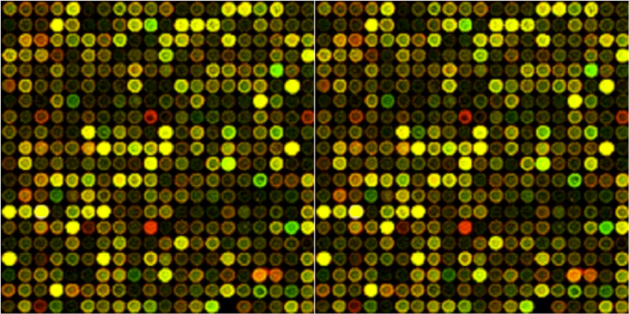

# Gene Expression Datasets



A collection of published gene expression datasets, mostly from [microarray](https://en.wikipedia.org/wiki/DNA_microarray) and [RNA-seq](https://en.wikipedia.org/wiki/RNA-Seq) studies, packaged for teaching and reproducible analysis.

## Layout

Each dataset lives in `datasets/{name}/` and contains:

- `{name}.tsv`: the canonical expression matrix (genes as rows, samples as columns)
- `{name}.pdf`: the source paper
- `README.md`: dataset-level documentation, including the source citation, experimental design, sample breakdown, platform, the scale of the matrix (raw intensity, log2, log-ratio), and a one-line `pandas.read_table` snippet for loading
- Sample sheets / metadata files where applicable (`*.samples.tsv`, `*.meta.csv`)

## Datasets

Sorted approximately by analytical complexity. The first few are clean two-condition studies that drop into a standard differential-expression pipeline; the later ones include multi-condition designs, large cohorts with covariates, time courses, and RNA-seq.

| Dataset | Description | Organism | Samples | Scale | PMID | GEO |
|---------|-------------|----------|--------:|-------|------|-----|
| [IRF6](datasets/irf6) | Cleft lip and palate / IRF6 knockout | Mouse | 6 (3+3) | Raw intensity | [17041601](https://pubmed.ncbi.nlm.nih.gov/17041601/) | [GSE5800](https://www.ncbi.nlm.nih.gov/geo/query/acc.cgi?acc=GSE5800) |
| [HDAC1](datasets/hdac1) | Histone deacetylase 1 KO in mouse ES cells | Mouse | 6 (3+3) | Raw intensity | [16940178](https://pubmed.ncbi.nlm.nih.gov/16940178/) | [GSE5583](https://www.ncbi.nlm.nih.gov/geo/query/acc.cgi?acc=GSE5583) |
| [Huntington's](datasets/huntingtons) | HD blood transcriptomics | Human | 22 (10+12) | log2 | [16043692](https://pubmed.ncbi.nlm.nih.gov/16043692/) | [GSE8762](https://www.ncbi.nlm.nih.gov/geo/query/acc.cgi?acc=GSE8762) |
| [Leukemia (Golub)](datasets/leukemia) | AML vs ALL classification | Human | 38 (27+11) | Log-ratio | [10521349](https://pubmed.ncbi.nlm.nih.gov/10521349/) |   |
| [Breast cancer](datasets/breast_cancer) | BRCA1/BRCA2 heterozygosity markers | Human | 26 (9+9+8) | log2 | [23341570](https://pubmed.ncbi.nlm.nih.gov/23341570/) |   |
| [Primates diet](datasets/primates_diet) | Diet effect on liver expression | Mouse | 24 (8 groups × 3) | Raw intensity | [18231591](https://pubmed.ncbi.nlm.nih.gov/18231591/) | [GSE6285](https://www.ncbi.nlm.nih.gov/geo/query/acc.cgi?acc=GSE6285) |
| [Parkinson's](datasets/parkinsons) | Drug-naive PD blood transcriptomics | Human | 59 (19+40) | log2 | [26510930](https://pubmed.ncbi.nlm.nih.gov/26510930/) | [GSE72267](https://www.ncbi.nlm.nih.gov/geo/query/acc.cgi?acc=GSE72267) |
| [Cognitive aging](datasets/cognitive_aging) | Hippocampal aging time course | Rat | 49 (5 ages) | Raw intensity | [19211887](https://pubmed.ncbi.nlm.nih.gov/19211887/) | [GSE9990](https://www.ncbi.nlm.nih.gov/geo/query/acc.cgi?acc=GSE9990) |
| [Medulloblastoma](datasets/medulloblastoma) | Pediatric brain tumor subgroups | Human | 73 (4 subgroups) | log2 | [22722829](https://pubmed.ncbi.nlm.nih.gov/22722829/) | [GSE37418](https://www.ncbi.nlm.nih.gov/geo/query/acc.cgi?acc=GSE37418) |
| [African apes](datasets/african_apes) | Human and African great ape fibroblasts | Multi-species | 39 (18+10+11) | Raw intensity | [12840040](https://pubmed.ncbi.nlm.nih.gov/12840040/) | [GSE426](https://www.ncbi.nlm.nih.gov/geo/query/acc.cgi?acc=GSE426) |
| [COVID-19](datasets/covid19) | COVID-19 severity (RNA-seq, plasma) | Human | 126 (2×2 factorial) | log2(TPM+1) | [33096026](https://pubmed.ncbi.nlm.nih.gov/33096026/) | [GSE157103](https://www.ncbi.nlm.nih.gov/geo/query/acc.cgi?acc=GSE157103) |
| [Cell cycle (Spellman)](datasets/cell_cycle) | Yeast cell cycle time course | Yeast | 14 time points | Log-ratio | [9843569](https://pubmed.ncbi.nlm.nih.gov/9843569/) |   |

## Loading

Every dataset loads with one URL pattern:

```python
import pandas as pd

DATASET = "irf6"  # or any name from the table above
URL = (f"https://media.githubusercontent.com/media/ahmedmoustafa/"
       f"gene-expression-datasets/main/datasets/{DATASET}/{DATASET}.tsv")
data = pd.read_table(URL, index_col=0)
```

The `Scale` column in the table tells you whether you need to apply `np.log2()` before per-gene statistical tests. See the per-dataset `README.md` for details, sample-sheet structure, and analysis caveats.
